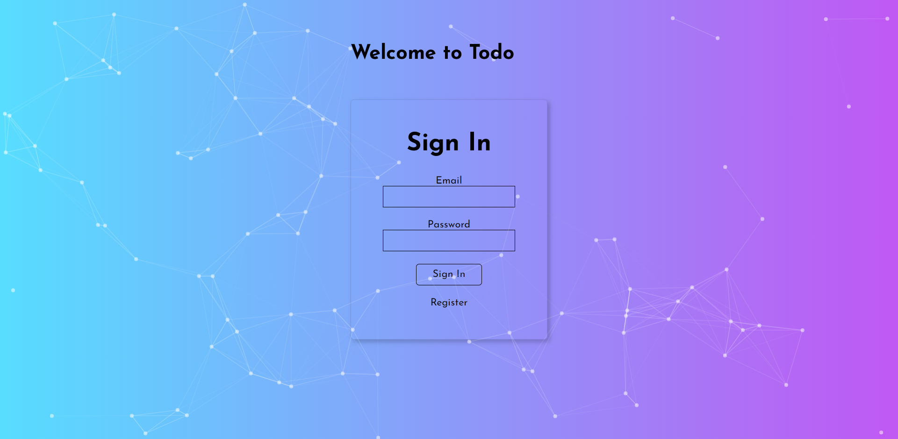
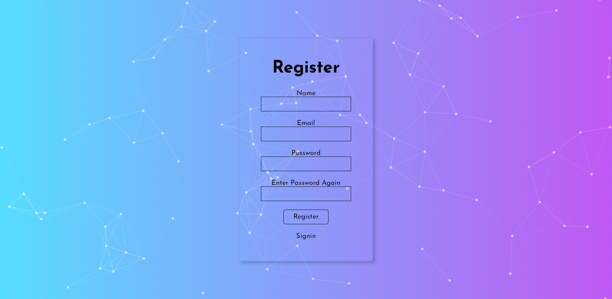
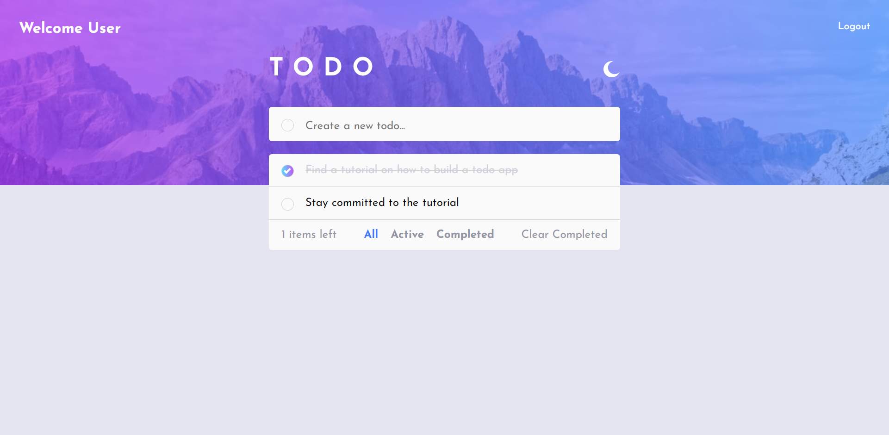

## A full stack Todo App

### Screenshot

### Links

- Live Site URL: [Live](https://fm-fullstacktodoapp.herokuapp.com)

### Built with
- NodeJS
- ExpressJs
- MongoDB
- Semantic HTML5 markup
- SCSS
- Flexbox
- CSS Grid
- Mobile-first workflow
- Redux
- Redux toolkit
- axios
- [React](https://reactjs.org/) - JS library
- Heroku

## Author

- Website - [Jesufemi Oladapo]
- Blog - [myBlog](https://blog.jesufemi.dev)
- Twitter - [@jesufemigan](https://www.twitter.com/jesufemigan)
